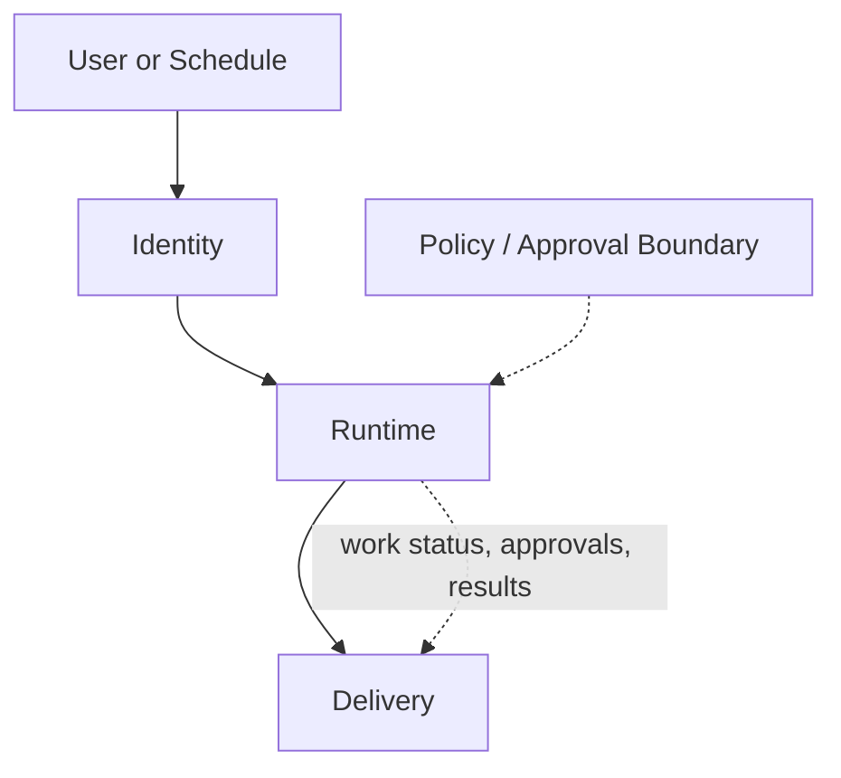
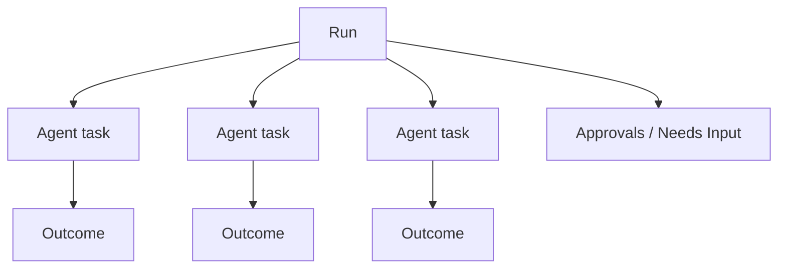

# Coordinated Agent Runtime Architecture

**Date:** 2026-04-04  
**Status:** Accepted  
**Builds on:** `2026-03-31-agent-evolution-design.md`  
**Purpose:** Define the smallest durable runtime model that lets a lead agent coordinate delegated AgentTask work without exposing containers or orchestration complexity in the product UI.

## Why This Exists

Nochore’s current runtime assumes:

- one run
- one visible live execution thread
- one flat event stream

That works for direct work and today’s inline `delegate_task`, but it breaks down when the lead agent needs to:

- fan out internal work in parallel
- pause on approvals
- resume after delegated tasks complete
- keep the frontend calm while multiple execution units are active

The architecture should preserve the product promise:

**one accountable lead agent on the surface, many coordinated work units underneath.**

## Reality Check: Current Code

The current codebase is now layered around `AgentTask`. The lead run owns accountability and final synthesis, while a small coordinator helper owns delegated task orchestration.

| Proposed surface | What exists today | Main gap |
|---|---|---|
| Identity | `AgentRecord` plus prompt assembly in `buildPromptBundle()` | No reusable identity object; identity is mostly compiled straight into prompt text |
| Runtime | `agent-run.ts`, `agent-task-run.ts`, `agent-session.ts`, `agent-task-coordinator.ts`, `agent-task-execution.ts`, and `tool-envelope.ts` | Parallel fan-out and durable artifact projection remain future work |
| Delivery | SSE polling full snapshots every second | Uses projected `tasks[]`; structured artifact projection remains future work |

Additional concrete issues:

- Learned-rule suggestion detection should stay single-owner in `apps/web/src/server/approvals-core.ts`; the worker runtime should not duplicate `policy_rule_suggested` events for the same approval lifecycle.
- Trigger.dev metadata is populated in `agent-run.ts`, but the frontend does not consume it. The current live UI reads projected snapshots, not Trigger metadata.

## Core Thesis

- **Single-face UX, multi-unit runtime**
- **Async substrate, hybrid execution feel**
- **Frontend tracks agent tasks, not containers**
- **The lead agent owns final synthesis**
- **No agent task may exceed parent policy**
- **Chat is a surface over reality, not the source of truth**

## Top-Level Architecture

For implementation, the architecture should be framed as **three top-level surfaces**:

1. `Identity`
2. `Runtime`
3. `Delivery`

`Inbox / notification / conversation` should be treated as a routing model across runtime and delivery, not as a standalone architectural layer in Phase 1.



## 1. Identity

The identity surface is the durable definition of the agent between runs. It should stay small and honest.

### Identity owns

- agent core record
- base instructions
- tool policy
- connected capability metadata
- workspace knowledge
- durable lessons
- conversation continuity anchors

### Identity does not own

- runtime prompt bundle
- live tool clients
- task plan
- agent task state
- execution outputs

### Current anchors

- `packages/harness/src/repositories/agent.ts`
- `packages/harness/src/types/agent-config.ts`
- `packages/harness/src/workspace/store.ts`
- `packages/harness/src/repositories/lesson.ts`
- `packages/harness/src/repositories/conversation-thread.ts`

### Design note

Do **not** formalize a separate `IdentitySnapshot` JSON contract yet. The current runtime already compiles identity from:

- `AgentRecord`
- workspace knowledge
- selected skills
- lessons
- conversation thread/checkpoint state

Formalize a reusable identity object when there is a second concrete consumer besides the runtime prompt builder.

## 2. Runtime

The runtime surface contains two internal sublayers:

1. `Orchestration`
2. `Execution`

These are conceptually different, but they should be implemented as one coherent runtime surface in Phase 1.

### Runtime responsibilities

- load agent identity
- decide how to handle the current turn
- create AgentTask records
- wait for or resume from AgentTask runs
- synthesize task results
- enforce policy inheritance
- emit durable status and result projections

### Runtime modes

Externally, the runtime should only expose two modes:

| Mode | Meaning |
|---|---|
| `direct` | Lead agent handles bounded work itself |
| `coordinated` | Lead agent creates AgentTask records and later synthesizes the results |

Do **not** expose `coordinate_later` as a separate top-level mode in Phase 1. Trigger.dev checkpoint/resume should hide most of the sync/async distinction from the product model.

### Synthesis barrier

The synthesis barrier is:

1. create AgentTask records
2. trigger `agent-task-run` execution
3. wait for completion using Trigger.dev fan-out/fan-in semantics
4. re-enter the coordinator
5. synthesize

There should be no custom polling loop in the runtime design.

### Agent task failure contract

Agent task failure must be explicit from the start.

Default behavior:

1. task execution marks its AgentTask record `failed`
2. failure reason is recorded on the AgentTask and projected into the parent run
3. coordinator decides one of:
   - retry
   - continue with partial results
   - abort the run

Default coordinator policy should be **best effort**:

- if a failed agent task was optional, synthesize with partial results
- if a failed agent task was required, fail the parent run or request human input

Agent task retries should rely on Trigger.dev task-level retry configuration rather than custom retry loops inside the coordinator.

### Policy inheritance

Policy flows down, never around.

- lead agent defines the approval and tool envelope
- AgentTask execution inherits a narrowed version of that envelope
- AgentTask execution may restrict further
- AgentTask execution may never widen access or autonomy beyond the parent

## 3. Delivery

Delivery turns runtime state into product surfaces.

### Delivery owns

- projected run state
- projected agent-task state
- approvals and needs-input projections
- activity projections
- final result summaries
- notification routing

### Delivery does not own

- planning
- tool execution
- policy decisions
- long-term identity

### Current delivery reality

Today the frontend consumes snapshots over SSE from:

- `apps/web/src/routes/api.activity-stream.ts`

Those snapshots are currently derived from projected run state, not from Trigger.dev metadata.

That means the target architecture should improve the projection model, not couple the frontend directly to task containers or Trigger internals.

## Frontend Contract

The frontend should not model containers. It should model one top-level run plus child agent tasks.



### Core rule

The UI should care about **agent-task lifecycle**, not execution-container lifecycle.

### Recommended view model

The top-level run view can stay named `RunView` for migration purposes, but should evolve toward:

```ts
interface RunView {
  id: string;
  agentId: string;
  triggerType: "chat" | "manual" | "cron" | "webhook";
  mode: "direct" | "coordinated";
  status:
    | "queued"
    | "running"
    | "waiting_for_tasks"
    | "waiting_for_approval"
    | "waiting_for_external"
    | "completed"
    | "failed"
    | "cancelled";
  startedAt: string;
  completedAt?: string;
  tasks: AgentTaskView[];
  approvals: PendingActionView[];
  events: RunEventView[];
  summary?: RunResultView;
}
```

```ts
interface AgentTaskView {
  id: string;
  parentRunId: string;
  kind: "agent_task_run";
  role: string;
  title: string;
  status:
    | "queued"
    | "running"
    | "waiting_for_approval"
    | "waiting_for_external"
    | "completed"
    | "failed"
    | "cancelled";
  startedAt?: string;
  completedAt?: string;
  inputTokens?: number;
  outputTokens?: number;
  blockingReason?: "approval" | "dependency" | "external" | "policy";
}
```

`partially_blocked` should **not** be a canonical run status. If the UI wants that view, it can derive it from agent-task state.

### What the frontend needs

For Phase 1, the UI needs:

- one lead-agent run
- nested agent tasks under that run
- approval state
- current active run selection
- projected progress across AgentTask work

It does **not** need:

- child containers
- raw task prompt state
- a general inbox model yet
- peer-agent coordination yet

## Phase 1 Data Model

Phase 1 should introduce exactly one new durable concept:

- `agent_tasks`

Everything else can remain projected from existing run and approval state for now.

### AgentTaskRecord

```ts
interface AgentTaskRecord {
  id: string;
  parentRunId: string;
  rootRunId: string;
  agentId: string;
  kind: "agent_task_run";
  role: string;
  title: string;
  status:
    | "queued"
    | "running"
    | "waiting_for_approval"
    | "waiting_for_external"
    | "completed"
    | "failed"
    | "cancelled";
  blockingReason?: "approval" | "dependency" | "external" | "policy";
  error?: string;
  inputTokens?: number;
  outputTokens?: number;
  createdAt: Date;
  startedAt?: Date;
  completedAt?: Date;
}
```

### Observability and tracing

Every AgentTask event should carry enough correlation data to answer:

**“show me everything related to run X across all agent tasks.”**

Minimum correlation fields:

- `rootRunId`
- `parentRunId`
- `taskId`

That applies to:

- agent-task records
- AgentTask execution events
- projected timeline events
- approval records created from AgentTask work

## Implementation Status

### Shipped: Phase 1 — Foundation (2026-04-04)

- `agent_tasks` table with full lifecycle (AgentTaskRepository)
- `agent-task-run` child Trigger.dev task via `triggerAndWait`
- `delegate_task` refactored from inline agent execution to durable child tasks
- DB-backed task limit (replaces closure counter)
- Events carry `taskId` and `rootRunId` for correlation
- `SerializedRun` + `RunView` include `tasks[]`
- `TasksSection` in `RunDetail` renders role, title, status, duration
- SSE version derivation includes agent task timestamps
- Shared `run-helpers.ts` extracted for reusable event and approval helpers

### Shipped: Phase 2A — Hardening (2026-04-04)

- `agent_task_id` nullable column on `approvals` table (additive migration)
- `waiting_for_tasks` run status with transitions around `triggerAndWait`
- Frontend "Coordinating" badge + agent tasks view (replaces spinner)
- Token counting: `inputTokens`/`outputTokens` accumulated from AI SDK `turn_end` events, stored on agent tasks

### Shipped: AgentTask runtime rewrite (2026-04-26)

- Canonical domain name is `AgentTask`; runtime/API/UI language is `tasks` and `taskId`
- Removed `WorkItem`, `workItems`, `workItemId`, `spawn_sub_run`, `sub_run_*`, and `waiting_for_children` from the active runtime surface
- `runAgentSession(spec)` in `services/worker/src/lib/agent-session.ts` owns executor-neutral event recording, policy gate, approval checkpoints, metric tool injection, learned rules, and token result plumbing
- Lead run passes a tool envelope that includes `delegate_task`; AgentTask runs receive a narrowed envelope with no delegation tool
- Runtime reset migration preserves identity/configuration and durable memory while clearing runs, run events, approvals, and obsolete task correlation records

### Shipped: Phase 2 — Boundary hardening (2026-05-03)

- `agent-task-coordinator.ts` owns `delegate_task`, AgentTask record creation, parent status transitions, `triggerAndWait`, task events, and best-effort child failure handling
- `tool-envelope.ts` makes lead and AgentTask tool envelopes explicit; AgentTask envelopes exclude `delegate_task` by construction
- `runAgentSession(spec)` accepts injected execution and approval handlers for lifecycle tests while defaulting to the normal agent executor and approval flow
- Worker tests cover delegation lifecycle, best-effort task failure, task-limit blocking, tool-envelope narrowing, session metric correlation, and task approval correlation

### Shipped: Phase 3 — AgentTask execution contract (2026-05-03)

- `agent-task-execution.ts` owns the child execution boundary: task-specific prompt, narrowed tool envelope, session execution, approval callbacks, token plumbing, and typed task result normalization
- AgentTask results normalize to `{ summary, findings, artifacts, metrics, nextActions, rawText }` and are stored as JSON in the existing `agent_tasks.result` field
- `tool-envelope.ts` validates reserved internal tool names (`delegate_task`, `record_metric`, `submit_report`) and duplicate provider tool names
- `agent-task-run.ts` is now mostly Trigger.dev plumbing around `AgentTaskExecution`

### Shipped: Phase 4 — Executor adapter boundary (2026-05-03)

- `agent-executor.ts` defines the executor-neutral contract: prompt, workspace, tools, events, policy gate hook, and tokenized result
- `agent-session.ts` depends on the neutral executor contract; policy, approvals, metric recording, learned rules, and correlation no longer know about the concrete pi-coding-agent adapter
- `flue-runtime.ts` is now the default adapter behind `defaultAgentExecutor`; `pi-runtime.ts` remains an explicit fallback
- Shared tool names are executor-neutral: `AgentToolDefinition`, `getGoogleAdsAgentTools`, and `getComposioAgentTools`

### Shipped: Cleanup (2026-04-04)

- Single-owner learned rule detection (worker runtime does not duplicate web server suggestions)
- Removed unused Trigger.dev metadata events (`liveEvents` array)
- Kept `metadata.set("status", ...)` for Trigger.dev dashboard

### Not yet built

| Item | Priority | Notes |
|---|---|---|
| Parallel fan-out (`batchTriggerAndWait`) | Medium | Enables LLM to plan multiple agent tasks then wait for all |
| `artifacts` table | Low | Structured durable outputs; typed task results currently live in `agent_tasks.result` JSON |
| Progressive autonomy QA fixes (1-4) | Medium | Edge cases in learned rules; no production data yet |
| Detection pipeline tests | Medium | pattern-detector, condition-extractor, rule-resolver have zero unit tests |
| Pinned specialists (V0.3) | Low | `SPECIALIST.md` in workspace for reusable roles |
| Delegation config | Low | Per-agent `maxAgentTasks`; currently hardcoded at 3 |
| `inbox_items` | Low | Only needed for peer agents |
| Peer coordination | Low | V1.0+ per evolution doc |

## Future: Peer Coordination

Future concepts (not Phase 1-2):

- `peer_request` / `peer_result`
- `coordinationRights`
- peer-agent tasks
- project topology fields

## Invariants

1. The lead agent owns final synthesis.
2. Agent tasks remain internal product objects.
3. No agent task may exceed parent policy.
4. Chat is a surface over reality, not the source of truth for coordinated work.
5. The frontend thinks in runs and agent tasks, not containers.
6. Agent task failure must be visible and recoverable at the coordinator level.
