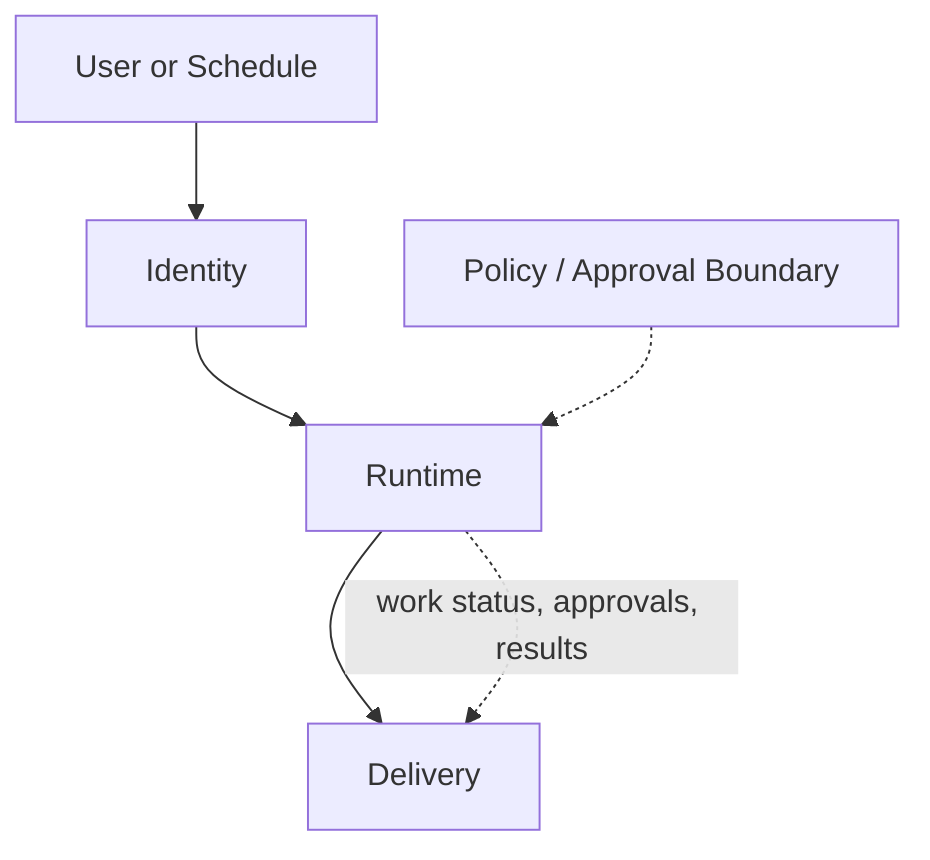
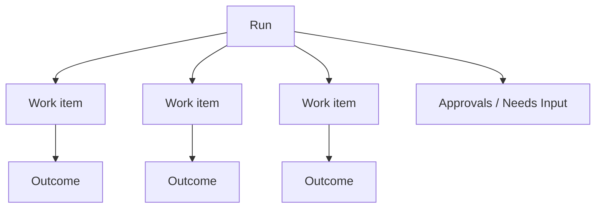

# Coordinated Agent Runtime Architecture

**Date:** 2026-04-04  
**Status:** Accepted  
**Builds on:** `2026-03-31-agent-evolution-design.md`  
**Purpose:** Define the smallest durable runtime model that lets a lead agent coordinate child work without exposing containers or orchestration complexity in the product UI.

## Why This Exists

Nochore’s current runtime assumes:

- one run
- one visible live execution thread
- one flat event stream

That works for direct work and today’s inline `spawn_sub_run`, but it breaks down when the lead agent needs to:

- fan out internal work in parallel
- pause on approvals
- resume after child work completes
- keep the frontend calm while multiple execution units are active

The architecture should preserve the product promise:

**one accountable lead agent on the surface, many coordinated work units underneath.**

## Reality Check: Current Code

The current codebase is not layered yet.

| Proposed surface | What exists today | Main gap |
|---|---|---|
| Identity | `AgentRecord` plus prompt assembly in `buildPromptBundle()` | No reusable identity object; identity is mostly compiled straight into prompt text |
| Runtime | `agent-run.ts` plus inline `spawn_sub_run` | No explicit work-item model; sub-runs are only events under the parent run |
| Delivery | SSE polling full snapshots every second | No first-class work-item or artifact projection yet |

Additional concrete issues:

- Learned-rule suggestion detection currently runs in both `apps/web/src/server/approvals-core.ts` and `services/worker/src/triggers/agent-run.ts`, which can duplicate `policy_rule_suggested` events for the same approval lifecycle.
- Trigger.dev metadata is populated in `agent-run.ts`, but the frontend does not consume it. The current live UI reads projected snapshots, not Trigger metadata.

## Core Thesis

- **Single-face UX, multi-unit runtime**
- **Async substrate, hybrid execution feel**
- **Frontend tracks work items, not containers**
- **The lead agent owns final synthesis**
- **No child unit may exceed parent policy**
- **Chat is a surface over reality, not the source of truth**

## Top-Level Architecture

For implementation, the architecture should be framed as **three top-level surfaces**:

1. `Identity`
2. `Runtime`
3. `Delivery`

`Inbox / notification / conversation` should be treated as a routing model across runtime and delivery, not as a standalone architectural layer in Phase 1.



## 1. Identity

The identity surface is the durable definition of the agent between runs. It should stay small and honest.

### Identity owns

- agent core record
- base instructions
- tool policy
- connected capability metadata
- workspace knowledge
- durable lessons
- conversation continuity anchors

### Identity does not own

- runtime prompt bundle
- live tool clients
- task plan
- worker state
- execution outputs

### Current anchors

- `packages/harness/src/repositories/agent.ts`
- `packages/harness/src/types/agent-config.ts`
- `packages/harness/src/workspace/store.ts`
- `packages/harness/src/repositories/lesson.ts`
- `packages/harness/src/repositories/conversation-thread.ts`

### Design note

Do **not** formalize a separate `IdentitySnapshot` JSON contract yet. The current runtime already compiles identity from:

- `AgentRecord`
- workspace knowledge
- selected skills
- lessons
- conversation thread/checkpoint state

Formalize a reusable identity object when there is a second concrete consumer besides the runtime prompt builder.

## 2. Runtime

The runtime surface contains two internal sublayers:

1. `Orchestration`
2. `Execution`

These are conceptually different, but they should be implemented as one coherent runtime surface in Phase 1.

### Runtime responsibilities

- load agent identity
- decide how to handle the current turn
- create child work
- wait for or resume from child work
- synthesize child results
- enforce policy inheritance
- emit durable status and result projections

### Runtime modes

Externally, the runtime should only expose two modes:

| Mode | Meaning |
|---|---|
| `direct` | Lead agent handles bounded work itself |
| `coordinated` | Lead agent creates child work and later synthesizes the results |

Do **not** expose `coordinate_later` as a separate top-level mode in Phase 1. Trigger.dev checkpoint/resume should hide most of the sync/async distinction from the product model.

### Synthesis barrier

The synthesis barrier is:

1. create child work items
2. trigger child execution in parallel
3. wait for completion using Trigger.dev fan-out/fan-in semantics
4. re-enter the coordinator
5. synthesize

There should be no custom polling loop in the runtime design.

### Worker failure contract

Worker failure must be explicit from the start.

Default behavior:

1. worker marks its work item `failed`
2. failure reason is recorded on the work item and projected into the parent run
3. coordinator decides one of:
   - retry
   - continue with partial results
   - abort the run

Default coordinator policy should be **best effort**:

- if a failed work item was optional, synthesize with partial results
- if a failed work item was required, fail the parent run or request human input

Worker retries should rely on Trigger.dev task-level retry configuration rather than custom retry loops inside the coordinator.

### Policy inheritance

Policy flows down, never around.

- lead agent defines the approval and tool envelope
- child work inherits a narrowed version of that envelope
- child work may restrict further
- child work may never widen access or autonomy beyond the parent

## 3. Delivery

Delivery turns runtime state into product surfaces.

### Delivery owns

- projected run state
- projected work-item state
- approvals and needs-input projections
- activity projections
- final result summaries
- notification routing

### Delivery does not own

- planning
- tool execution
- policy decisions
- long-term identity

### Current delivery reality

Today the frontend consumes snapshots over SSE from:

- `apps/web/src/routes/api.activity-stream.ts`

Those snapshots are currently derived from projected run state, not from Trigger.dev metadata.

That means the target architecture should improve the projection model, not couple the frontend directly to worker containers or Trigger internals.

## Frontend Contract

The frontend should not model containers. It should model one top-level run plus child work items.



### Core rule

The UI should care about **work-item lifecycle**, not execution-container lifecycle.

### Recommended view model

The top-level run view can stay named `RunView` for migration purposes, but should evolve toward:

```ts
interface RunView {
  id: string;
  agentId: string;
  triggerType: "chat" | "manual" | "cron" | "webhook";
  mode: "direct" | "coordinated";
  status:
    | "queued"
    | "running"
    | "waiting_for_children"
    | "waiting_for_approval"
    | "waiting_for_external"
    | "completed"
    | "failed"
    | "cancelled";
  startedAt: string;
  completedAt?: string;
  workItems: WorkItemView[];
  approvals: PendingActionView[];
  events: RunEventView[];
  summary?: RunResultView;
}
```

```ts
interface WorkItemView {
  id: string;
  parentRunId: string;
  kind: "worker";
  role: string;
  title: string;
  status:
    | "queued"
    | "running"
    | "waiting_for_approval"
    | "waiting_for_external"
    | "completed"
    | "failed"
    | "cancelled";
  startedAt?: string;
  completedAt?: string;
  inputTokens?: number;
  outputTokens?: number;
  blockingReason?: "approval" | "dependency" | "external" | "policy";
}
```

`partially_blocked` should **not** be a canonical run status. If the UI wants that view, it can derive it from work-item state.

### What the frontend needs

For Phase 1, the UI needs:

- one lead-agent run
- nested work items under that run
- approval state
- current active run selection
- projected progress across child work

It does **not** need:

- child containers
- raw worker prompt state
- a general inbox model yet
- peer-agent coordination yet

## Phase 1 Data Model

Phase 1 should introduce exactly one new durable concept:

- `work_items`

Everything else can remain projected from existing run and approval state for now.

### WorkItemRecord

```ts
interface WorkItemRecord {
  id: string;
  parentRunId: string;
  rootRunId: string;
  agentId: string;
  kind: "worker_run";
  role: string;
  title: string;
  status:
    | "queued"
    | "running"
    | "waiting_for_approval"
    | "waiting_for_external"
    | "completed"
    | "failed"
    | "cancelled";
  blockingReason?: "approval" | "dependency" | "external" | "policy";
  error?: string;
  inputTokens?: number;
  outputTokens?: number;
  createdAt: Date;
  startedAt?: Date;
  completedAt?: Date;
}
```

### Observability and tracing

Every child worker event should carry enough correlation data to answer:

**“show me everything related to run X across all work items.”**

Minimum correlation fields:

- `rootRunId`
- `parentRunId`
- `workItemId`

That applies to:

- work-item records
- child execution events
- projected timeline events
- approval records created from child work

## Implementation Status

### Shipped: Phase 1 — Foundation (2026-04-04)

- `work_items` table with full lifecycle (WorkItemRepository)
- `worker-run` child Trigger.dev task via `triggerAndWait`
- `spawn_sub_run` refactored from inline `executePiAgent()` to durable child tasks
- DB-backed sub-run limit (replaces closure counter)
- Events carry `workItemId` and `rootRunId` for correlation
- `SerializedRun` + `RunView` include `workItems[]`
- `WorkItemsSection` in `RunDetail` renders role, title, status, duration
- SSE version derivation includes work item timestamps
- Shared `run-helpers.ts` extracted for reuse by parent and child tasks

### Shipped: Phase 2A — Hardening (2026-04-04)

- `work_item_id` nullable column on `approvals` table (additive migration)
- `waiting_for_children` run status with transitions around `triggerAndWait`
- Frontend "Coordinating" badge + work items view (replaces spinner)
- Token counting: `inputTokens`/`outputTokens` accumulated from AI SDK `turn_end` events, stored on work items

### Shipped: Cleanup (2026-04-04)

- Single-owner learned rule detection (removed from worker, web server only)
- Removed unused Trigger.dev metadata events (`liveEvents` array)
- Kept `metadata.set("status", ...)` for Trigger.dev dashboard

### Not yet built

| Item | Priority | Notes |
|---|---|---|
| Parallel fan-out (`batchTriggerAndWait`) | Medium | Enables LLM to plan multiple workers then wait for all |
| `artifacts` table | Low | Structured durable outputs; currently using events + work item `result` column |
| Progressive autonomy QA fixes (1-4) | Medium | Edge cases in learned rules; no production data yet |
| Detection pipeline tests | Medium | pattern-detector, condition-extractor, rule-resolver have zero unit tests |
| Pinned specialists (V0.3) | Low | `SPECIALIST.md` in workspace for reusable roles |
| Delegation config | Low | Per-agent `maxSubRuns`; currently hardcoded at 3 |
| `inbox_items` | Low | Only needed for peer agents |
| Peer coordination | Low | V1.0+ per evolution doc |

## Future: Peer Coordination

Future concepts (not Phase 1-2):

- `peer_request` / `peer_result`
- `coordinationRights`
- peer-agent work items
- project topology fields

## Invariants

1. The lead agent owns final synthesis.
2. Workers remain internal product objects.
3. No child unit may exceed parent policy.
4. Chat is a surface over reality, not the source of truth for coordinated work.
5. The frontend thinks in runs and work items, not containers.
6. Worker failure must be visible and recoverable at the coordinator level.

