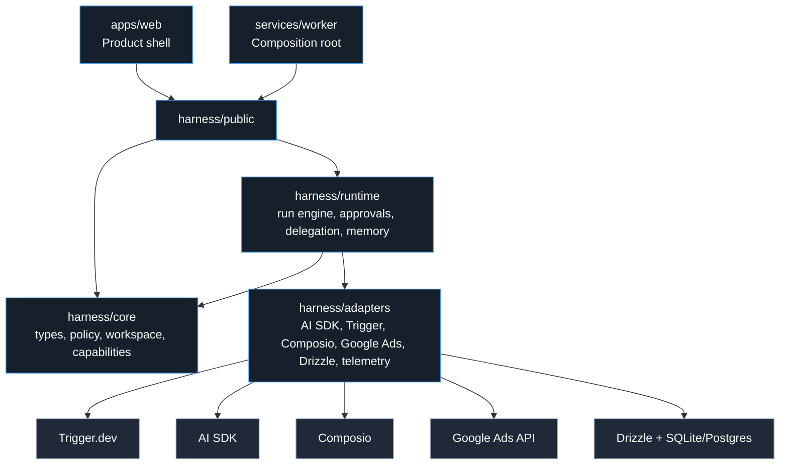
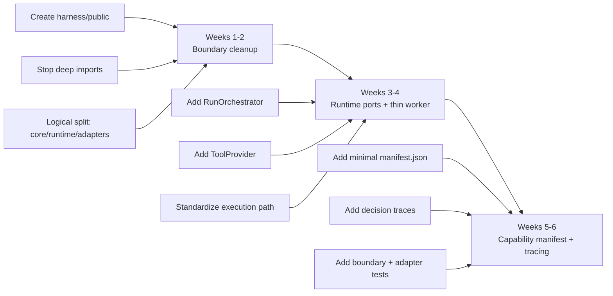

# Product-First Architecture Plan

**Date:** 2026-04-04
**Status:** Draft
**Builds on:** `docs/architecture/philosophy.md`, `docs/architecture/2026-03-31-agent-evolution-design.md`

## Why This Document Exists

Nochore is showing two truths at once:

1. It already has the beginnings of a reusable agent runtime.
2. It is still primarily a product, not a proven framework.

That creates a real risk: overengineering the platform before the product center of gravity is fully earned.

This document sets the next architecture direction with one constraint:

**Build clean seams now. Do not build a platform cathedral.**

## Core Decision

For the next phase, Nochore should be treated as:

**A product with framework ambitions.**

That means:

- keep the current product stack unless it is actively blocking progress
- separate domain/runtime logic from vendor wiring
- enforce a stable public harness boundary
- add only the smallest abstractions that preserve optionality
- delay package explosion, marketplace work, and heavier orchestration systems

## Goals

1. Make the architecture structurally honest.
2. Reduce coupling between product logic and vendor-specific runtime code.
3. Preserve the option to become a framework later without paying the full abstraction cost now.
4. Keep shipping product features while improving seams.

## Non-Goals

1. Do not turn Nochore into a multi-package framework immediately.
2. Do not replace the current stack for purity.
3. Do not build a marketplace, plugin ecosystem, or public SDK in this phase.
4. Do not adopt heavier workflow infrastructure unless existing limits force it.

## Architecture Principles

1. **Boundary discipline over abstraction volume**
   The main problem is not missing abstractions. It is that the existing boundaries are not enforced strongly enough.

2. **One product, one honest runtime**
   App and worker should consume the same harness surface, not deep-import internal files.

3. **Keep vendor choices, isolate vendor knowledge**
   `Trigger.dev`, `AI SDK`, `TanStack Start`, `Drizzle`, `SQLite`, and the current hybrid integration strategy are acceptable. The problem is where that knowledge lives.

4. **Earn physical package splits**
   Logical seams come first. Separate packages come only after those seams prove durable.

5. **Platform moves must buy product leverage**
   If an architectural step does not improve control, speed, or product safety in the next phase, it should probably wait.

## Current Problem Summary

Today the repo has the right raw ingredients, but they are mixed across the wrong layers:

- `packages/harness` contains domain logic, runtime logic, adapter logic, and public API concerns in one unbounded surface.
- `apps/web` and `services/worker` deep-import `packages/harness/src/...` internals rather than consuming a stable API.
- the worker run loop still knows too much about current infrastructure choices, especially tool sourcing and execution shape
- capability loading is still folder-discovery-first, which is fine for incubation but weak for compatibility and trust

## Recommended Target Shape

The next architecture should stay inside the existing `packages/harness` package, but split it logically into four layers.

```text
apps/
  web/                            # product UI, auth, chat transport, realtime token endpoints

services/
  worker/                         # composition root only

packages/
  harness/
    src/
      core/                       # pure domain
        types/
        policy/
        workspace/
        approvals/
        capabilities/

      runtime/                    # generic runtime behavior
        run-engine/
        conversation/
        memory/
        delegation/
        registry/

      adapters/                   # infrastructure implementations
        llm-ai-sdk/
        scheduler-trigger/
        tools-composio/
        tools-google-ads/
        persistence-drizzle/
        telemetry/

      public/                     # only supported import surface for app and worker
```

### Layer Responsibilities

**`core/`**

- typed contracts
- deterministic policy logic
- workspace invariants
- approval concepts
- capability definitions

**`runtime/`**

- run coordination
- approval flow orchestration
- sub-run delegation
- conversation/memory coordination
- capability loading rules

**`adapters/`**

- `AI SDK` model/provider integration
- `Trigger.dev` orchestration helpers
- `Composio` integration
- direct `Google Ads` integration
- `Drizzle` persistence implementations
- tracing and telemetry sinks

**`public/`**

- stable exports that app and worker are allowed to consume
- no deep imports from `src/...` internals outside the harness package

## Layer Diagram



## Dependency Rule

The dependency rule is simple:

- `apps/web` imports only from `harness/public`
- `services/worker` imports only from `harness/public`, plus local composition code
- `runtime` may depend on `core`
- `adapters` may depend on `runtime` and `core`
- `core` depends on no vendor-specific modules

This is the single highest-leverage architecture change in the next phase.

## What Stays

These choices are justified now and should stay:

- `TanStack Start + React 19` for the product shell
- `Trigger.dev` as the durable outer run container
- `AI SDK` as the primary model/provider layer
- `Drizzle` as the database access layer
- `SQLite` for now, unless deployment constraints prove otherwise
- hybrid integrations: direct APIs for critical domain systems, `Composio` for long-tail breadth

## What Changes

These changes are justified now:

1. **Stable harness API**
   Create a supported `public/` export surface and remove deep imports from app and worker.

2. **Minimum runtime ports**
   Add only the smallest interfaces that isolate current pain:
   - `RunOrchestrator`
   - `ToolProvider`
   - `Executor`

3. **Thin worker**
   `services/worker` becomes composition root and scheduling glue, not a second runtime architecture.

4. **Minimal capability manifest**
   Keep markdown instructions and knowledge files, but add a manifest that declares:
   - `id`
   - `version`
   - compatibility
   - required providers
   - permissions

5. **Single execution path**
   Standardize on one execution/model path instead of allowing runtime drift.

## What We Explicitly Avoid Right Now

1. separate `harness-core`, `harness-runtime`, `harness-adapters`, and `capability-sdk` packages
2. `Temporal`
3. marketplace infrastructure
4. a full plugin platform
5. large database-agnostic abstraction layers
6. full standards migration everywhere at once
7. replacing `TanStack Start`, `Trigger.dev`, or `AI SDK` for theoretical elegance

## Current-To-Future Mapping

| Current area | Target layer | Action |
|---|---|---|
| `packages/harness/src/types` | `core/types` | Move logically |
| `packages/harness/src/policy` | `core/policy` | Move logically |
| `packages/harness/src/workspace` | split between `core/workspace` and adapter-backed workspace implementations | Split by invariant vs implementation |
| `packages/harness/src/conversation` | `runtime/conversation` | Move logically |
| `packages/harness/src/catalog` | split between `core/capabilities` and `runtime/registry` | Split by definition vs loading |
| `packages/harness/src/connections` | split between `runtime` contracts and `adapters/tools-*` | Split by boundary |
| `packages/harness/src/db` | `adapters/persistence-drizzle` | Move logically |
| `packages/harness/src/repositories` | runtime store interfaces plus adapter implementations | Split by semantic ownership |
| `services/worker/src/triggers/agent-run.ts` | worker composition root + orchestrator adapter wiring | Thin down |
| `services/worker/src/lib/agent-runtime.ts` | split across runtime and adapters | Reduce mixed concerns |
| `apps/web/src/server/*` deep imports | `harness/public` | Stop deep imports |

## Minimum Useful Interfaces

The next phase should introduce only these interfaces:

### `RunOrchestrator`

- `startRun`
- `emitEvent`
- `waitForApproval`
- `spawnSubRun`
- `resumeRun`
- `cancelRun`

### `ToolProvider`

- `listTools`
- `invokeTool`

### `Executor`

- `runLoop`
- `handleToolStep`

These are enough to isolate current vendor coupling without inventing a full abstract machine.

## 6-Week Roadmap



### Weeks 1-2: Boundary Cleanup

- create `harness/public`
- reorganize harness into logical layers
- remove deep imports from app and worker
- preserve behavior

**Exit criteria:** app and worker consume only the public harness surface.

### Weeks 3-4: Thin Runtime Ports

- add `RunOrchestrator`, `ToolProvider`, and `Executor`
- move vendor-specific tool and scheduler knowledge behind those boundaries
- make the worker composition-root-only

**Exit criteria:** core run path no longer knows raw vendor-specific tool wiring details.

### Weeks 5-6: Minimum Platform Contracts

- add a minimal capability manifest
- add decision trace fields and tracing hooks
- strengthen tests around runtime boundaries and policy behavior

**Exit criteria:** capability loading has explicit metadata, and critical runtime decisions are explainable.

## Decision Gates

1. **After boundary cleanup**
   If this already removes most of the pain, stop and return focus to product work.

2. **After runtime port extraction**
   If current execution flow is still acceptable once wrapped, defer deeper executor work.

3. **After capability manifests**
   Only invest further if capability reuse, trust, or compatibility is becoming a real product constraint.

## When To Revisit Bigger Moves

### Split into multiple packages

Do this only when:

- the internal boundaries remain stable for multiple iterations
- different consumers need clearly versioned packages
- package-level isolation improves release discipline in practice

### Move to central Postgres control plane

Do this only when:

- local SQLite is actively hurting deployment shape
- multiple services need shared operational truth
- multi-user tenancy and permission boundaries are becoming real product requirements

### Evaluate Temporal

Do this only when:

- `Trigger.dev` is no longer sufficient for runtime durability or control
- the workflow model becomes substantially more complex across services
- the operational overhead is justified by real workflow pressure

## Bottom Line

Nochore should not act like a framework company yet.

It should act like a product that is serious about architecture.

That means the next phase is not about maximum abstraction. It is about:

- one honest harness boundary
- one honest runtime path
- thin vendor adapters
- just enough capability metadata

If those seams become real, Nochore can evolve into a framework later without having paid the full cost prematurely.
