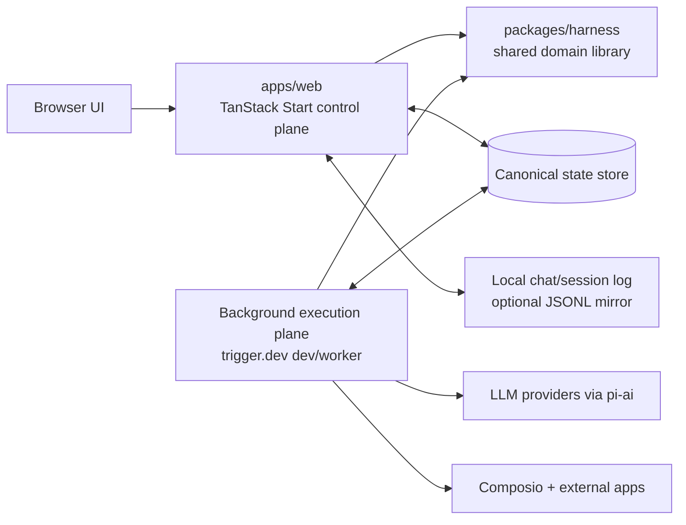
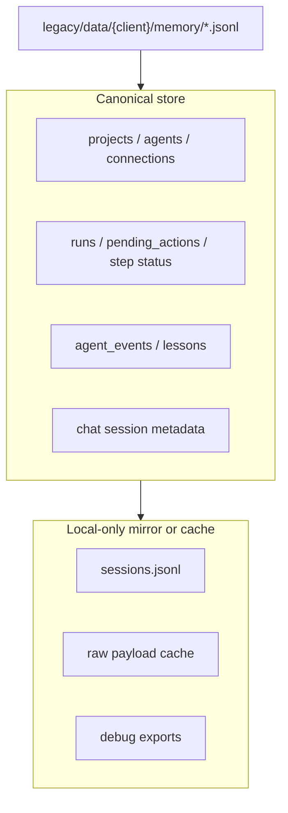
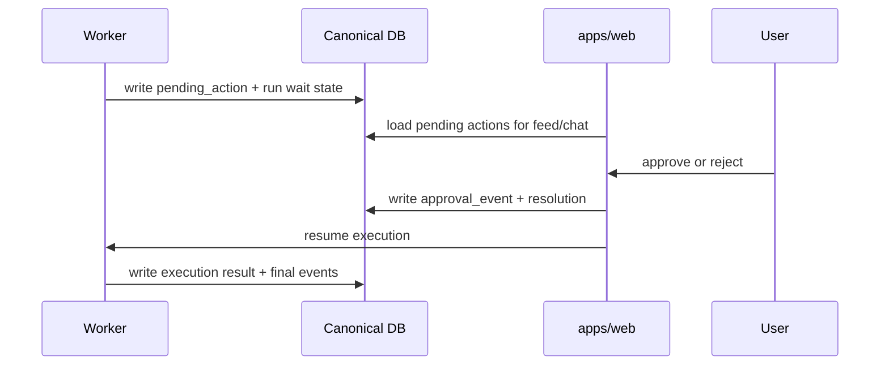

# Harness Architecture Expansion

This document extends the harness implementation plan and the March 21 design docs with the architectural decisions that are still implicit. It is based on the repo state after the foundation phase, not just on the intended end state.

## Current Ground Truth

What is implemented today:

- `packages/harness/` exists and is testable.
- Core contracts are implemented under `packages/harness/src/types/`.
- SQLite schema and client factory exist under `packages/harness/src/db/`.
- Harness tests pass for contracts and schema.

What is still design-only:

- `trigger.dev` orchestration
- `pi-ai` skill execution and planning
- `pi-agent-core` chat runtime
- Connection Manager and Composio integration
- MemoryStore implementation
- Frontend server functions
- Deployment topology and environment wiring
- Root workspace/package orchestration

The important consequence: the current diagrams are directionally right, but they still flatten several runtime boundaries that need to be made explicit before Phase 2 and beyond.

## Missing Layers To Focus On First

These are the missing architectural layers that will create churn if they stay implicit:

| Priority | Layer | Why it matters now |
|---|---|---|
| P0 | Runtime topology | The docs describe one harness, but the real system will have at least a web control plane and a background execution plane. |
| P0 | Persistence boundary | SQLite, JSONL, and future hosted storage are currently mixed together conceptually. One of them must be canonical. |
| P0 | Approval control plane | `pending_actions` exists in schema, but resume semantics, audit events, and UI-to-worker handoff are still undefined. |
| P1 | Chat session store | Agent memory and chat transcript state are different concerns and should not be conflated. |
| P1 | Connection subcomponents | Registry, sub-account mapping, permission overlays, health checks, and rate limiting need their own boundaries. |
| P1 | Deployment environments | Local dev, single-host MVP, and multi-instance hosted deployment need different storage assumptions. |
| P2 | Observability model | Runs, steps, tool calls, token usage, retries, and approval waits need a consistent trace shape. |
| P2 | Legacy migration path | The current CLI already has useful local memory patterns that should be preserved where they help. |

## Recommended Runtime Topology

The cleanest near-term architecture is a split between a control plane and an execution plane, while keeping the harness itself as a shared library.

### Interpretation

- `packages/harness` should remain a library, not a standalone service, until there is clear pressure to split it.
- `apps/web` is the control plane: setup, feed, approvals, chat entrypoint, project/agent CRUD.
- The background execution plane runs scheduled/manual/webhook jobs and approval resumptions.
- Both planes must share the same canonical persistence store.
- A local `sessions.jsonl` file can exist for chat/runtime ergonomics, but it should be treated as an adjunct log, not as the source of truth for agent memory or approval state.

## Deployment Recommendation

There are really three viable environments, and the architecture should acknowledge all three explicitly.

### 1. Local Development

Recommended default:

- `apps/web` runs locally on Node.
- trigger.dev runs in local dev mode.
- Canonical data lives in a local SQLite file per project.
- Chat/session transcripts can be mirrored to `data/{projectId}/chat/{agentId}/sessions.jsonl`.
- Composio uses local developer credentials and local OAuth callback URLs.

This environment should optimize for iteration speed and inspectability, not scale.

### 2. Single-Host MVP Deployment

Recommended first real deployment:

- One long-running Node host or container group
- Separate web and worker processes
- Shared persistent disk
- SQLite in WAL mode remains acceptable

This is the only hosted shape where the current SQLite choice remains operationally clean. Both the web plane and the worker plane can safely share the same DB file and local mirrored session files.

### 3. Multi-Instance Hosted Deployment

Required when you split web and worker across machines or use Trigger Cloud:

- Replace local SQLite with a shared remote database
- Keep the same repository/domain interfaces
- Keep session mirror files optional and non-canonical

If the worker and the web app do not share a filesystem, local SQLite stops being a safe canonical store. At that point the architecture should move to Postgres or libSQL/Turso. This migration path should be designed now even if it is not implemented yet.

## Persistence Strategy

### Decision

Use a database as the canonical memory and runtime state store.

Use JSONL only as a local compatibility/debugging surface where it is genuinely useful.

### Why

The harness needs more than append-only storage:

- filtered event queries for feed and policy
- pending approval lookup and resolution
- run history across triggers
- cross-agent lesson lookup at the project boundary
- connection health and permission state
- idempotency and deduplication

Those are database problems, not transcript-file problems.

### Recommended split

### Direct answer: local memory or database?

For the harness: database.

For pi-agent-style conversational state: optionally both, with the following rule:

- Database stores the canonical session metadata and any conversation fragments needed by product features.
- `sessions.jsonl` can mirror raw turns locally for replay, debugging, and interop with tooling that already expects that format.

Do not make the harness memory model depend on a raw transcript file format owned by a specific chat runtime.

## Missing Subcomponents In The Current Plan

The existing plan needs a few additional subcomponents before the later phases will fit together cleanly.

### 1. `chat/` needs a session store boundary

Add a `ChatSessionStore` abstraction:

- `getSession(agentId, sessionId?)`
- `appendTurn(...)`
- `listSessions(agentId)`
- `summarizeSession(...)`

Recommended storage shape:

- canonical metadata in DB
- optional raw turn mirror in `sessions.jsonl`

### 2. `db/` needs more runtime-oriented tables or projections

The current schema is a good start, but these concerns are still unmodeled:

- `chat_sessions`
- `chat_messages` or `chat_turns`
- `trigger_registrations`
- `approval_events`
- `connection_accounts` for explicit sub-account bindings
- optional `run_steps` if `runs.result` becomes too coarse for feed/monitor queries

### 3. `pipeline/` needs an explicit repository layer

Today the design jumps from orchestrator to DB tables. A thin repository layer will reduce coupling:

- `RunRepository`
- `ApprovalRepository`
- `ConnectionRepository`
- `LessonRepository`

This matters because the worker plane and the web plane will both need these writes and queries.

### 4. `connections/` needs internal subcomponents

The Connection Manager should not stay as one object for long. It wants at least:

- registry
- account binding resolver
- permission resolver
- health monitor
- rate limiter/backoff handler
- action executor

### 5. `memory/` needs two levels of semantics

The plan already says "events + lessons", but the boundary should be made stricter:

- events are operational truth
- lessons are distilled guidance
- chat transcript is neither

That separation keeps policy, feed, and chat from competing for ownership of the same data.

## Approval Flow Expansion

The approval flow should be treated as its own control-plane interaction, not just as a paused pipeline step.

Minimum invariants:

- approvals are idempotent
- approval actions are auditable
- user intent is persisted before the worker resumes
- the UI can reconstruct state even if the worker is temporarily unavailable

## Local-First Migration From The Legacy CLI

The legacy CLI proves two useful things:

- local append-only logs are easy to inspect
- structured memory by client already works operationally

What should be preserved:

- inspectable local files for development and debugging
- importability of old JSONL records into the new canonical store
- per-project/per-client directory structure under `data/`

What should change:

- move canonical querying and feed/policy reads to the database
- stop relying on ad hoc full-file scans for operational decisions
- separate transcript/logging concerns from product memory concerns

## Recommended Next Sequencing

Before implementing the rest of Phase 2 and Phase 3, tighten the architecture in this order:

1. Add a root workspace/package strategy so `apps/web` can consume `packages/harness` without ad hoc linking.
2. Add repository/store boundaries for runs, approvals, and chat sessions.
3. Keep SQLite as the canonical store for local development and single-host MVP.
4. Treat `sessions.jsonl` as an optional mirror, not the primary memory mechanism.
5. Only after that, implement trigger.dev tasks and chat tools on top of those boundaries.
6. When deployment needs split web/worker hosts, swap the canonical DB to a remote shared backend without changing the harness contracts.

## Final Recommendation

The architecture should be explicitly local-first but not local-only.

That means:

- SQLite is the right canonical store for the next phase.
- JSONL session files are useful, but only as a local mirror/debug surface.
- The harness memory model should stay database-centered.
- Web control plane and worker runtime should be treated as separate deployment planes even if they initially run on the same machine.
- Design the persistence and repository interfaces now so the future move to a shared hosted database is a storage swap, not a rewrite.
