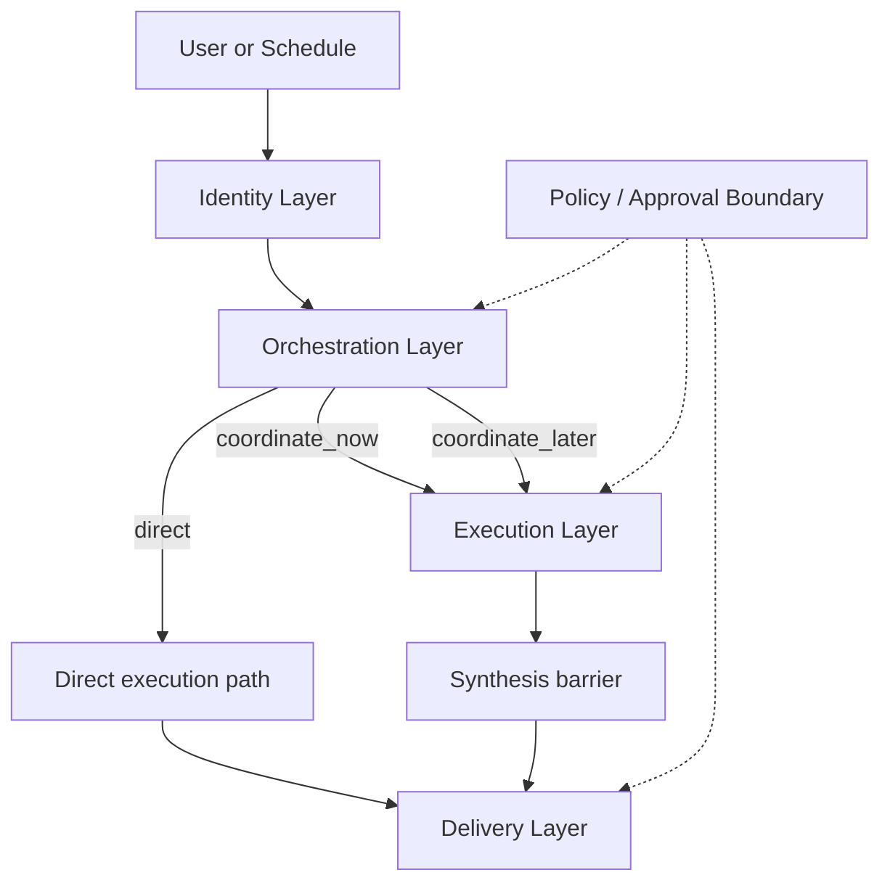
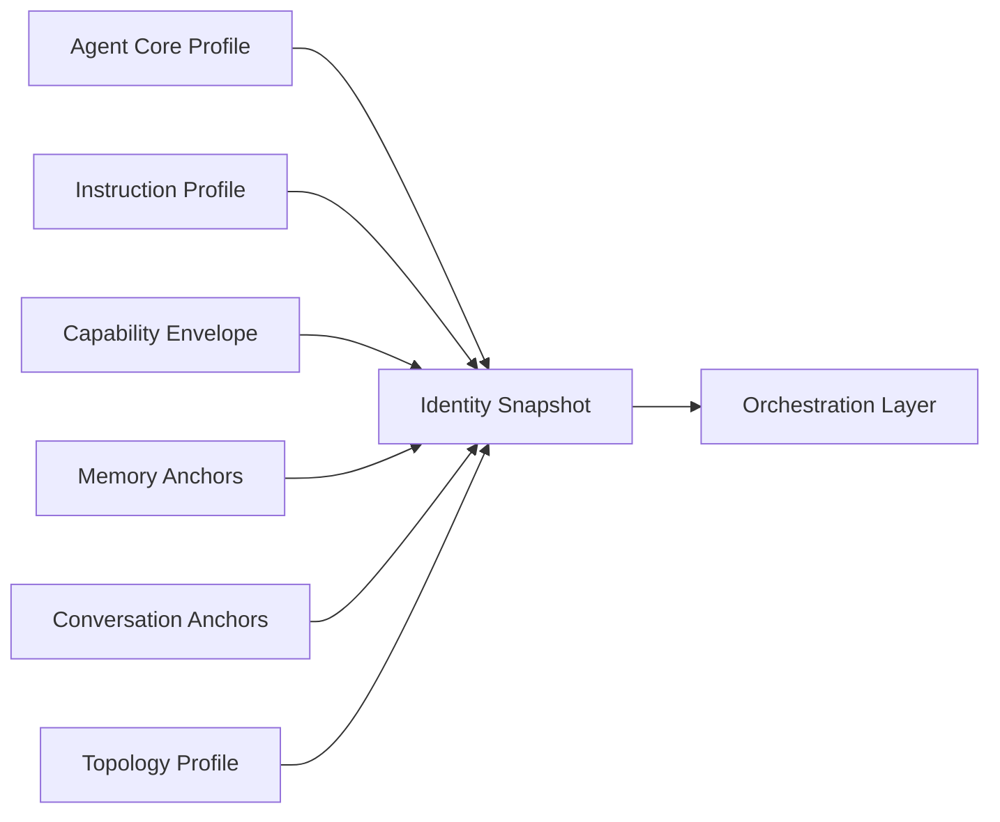
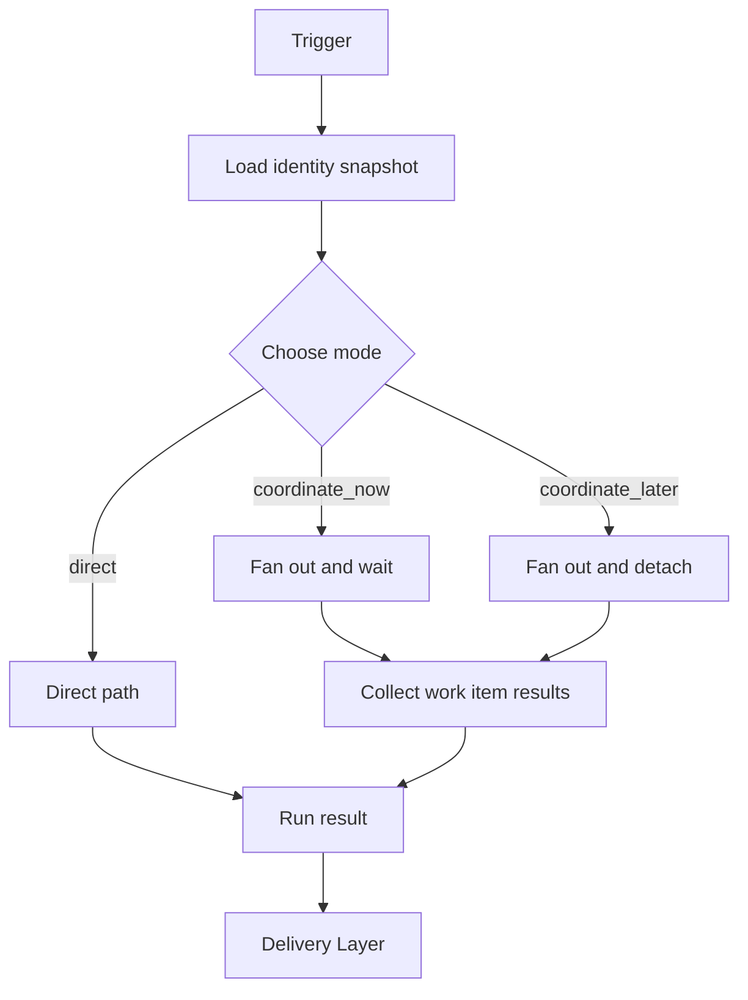
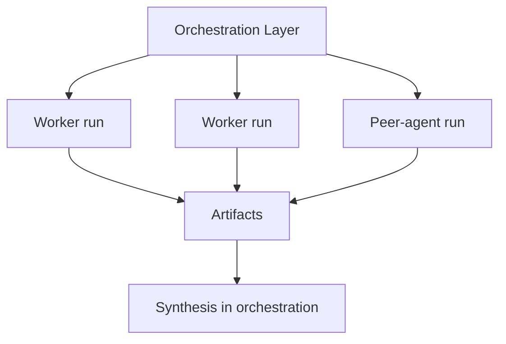
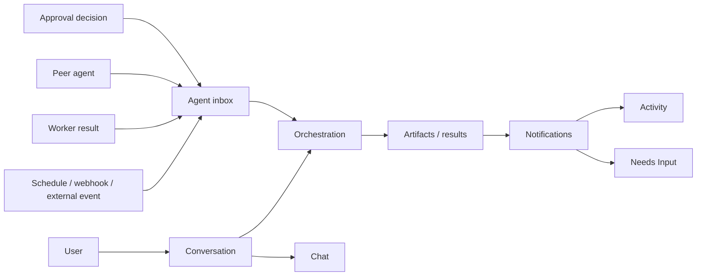
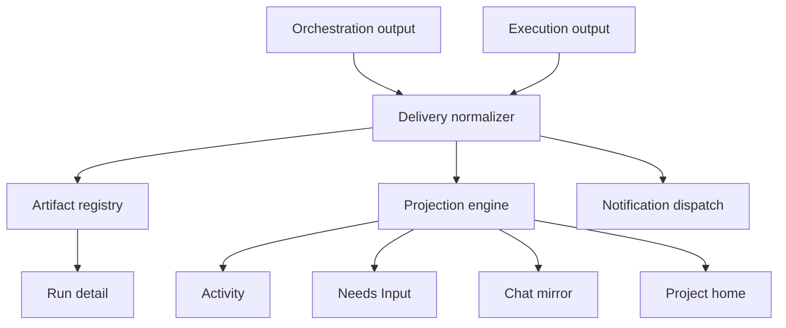
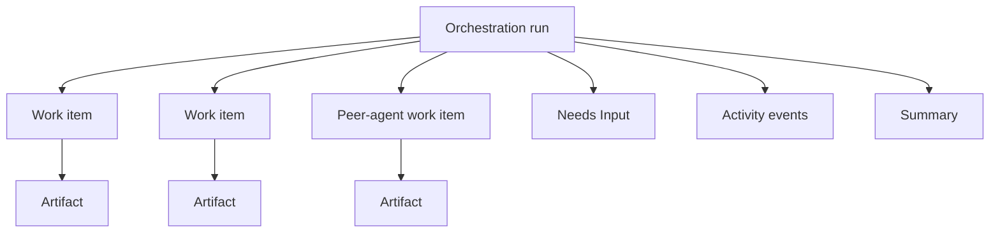

# Coordinated Agent Runtime Architecture

**Date:** 2026-04-04  
**Status:** Draft  
**Builds on:** `2026-03-31-agent-evolution-design.md`  
**Purpose:** Define the runtime, data model, and frontend contract for a lead-agent coordinator model that supports internal workers, peer agents, approvals, and pause/resume without exposing infrastructure complexity to the user.

## Why This Exists

Nochore is moving beyond the single-thread assumption of:

- one run
- one live container
- one flat event stream

That model is enough for direct work and inline sub-runs, but it breaks down when the lead agent needs to:

- fan out internal work in parallel
- coordinate durable peer agents
- pause on approvals
- detach and resume later
- keep the frontend legible while multiple execution units are active

The architecture should preserve the product promise:

**one accountable lead agent on the surface, many coordinated work units underneath.**

## Core Thesis

- **Single-face UX, multi-unit runtime**
- **Async substrate, hybrid execution**
- **Artifacts first, chat second**
- **Policy flows down, never around**
- **Frontend tracks work items, not containers**

The system should be built on durable asynchronous primitives, while still allowing the lead agent to complete bounded work synchronously when it is small enough to finish in one turn.

## Layer Model



The five architectural surfaces are:

1. `Identity Layer`
2. `Orchestration Layer`
3. `Execution Layer`
4. `Inbox / Notification / Conversation Model`
5. `Delivery Layer`

## 1. Identity Layer

The identity layer is the durable source of truth for who an agent is between runs. It owns the stable ingredients of the agent, not the live runtime state.

### Responsibilities



### Core components

| Component | Owns | Current anchors |
|---|---|---|
| Agent core profile | `id`, `projectId`, `name`, `description`, `status` | `packages/harness/src/repositories/agent.ts` |
| Instruction profile | Base instructions, voice, non-negotiable constraints | `packages/harness/src/repositories/agent.ts` |
| Capability envelope | Skills, provider requirements, tool policy, approval posture, delegation and coordination rights | `packages/harness/src/types/agent-config.ts`, `packages/harness/src/skills/prompt-skills.ts` |
| Memory anchors | Workspace knowledge, durable lessons, checkpoint references | `packages/harness/src/workspace/store.ts`, `packages/harness/src/repositories/lesson.ts` |
| Conversation anchors | Primary thread, channel metadata, compaction state | `packages/harness/src/repositories/conversation-thread.ts`, `packages/harness/src/types/conversation.ts` |
| Topology profile | Peer agents, pinned specialists, coordination rights | future extension |

### Identity owns

- Stable authored instructions
- Tool policy and capability metadata
- Durable memory and lesson references
- Conversation continuity
- Project/team role

### Identity does not own

- Runtime prompt bundle
- Live tool instances
- Current task plan
- Worker specs
- In-flight execution state

### Identity snapshot contract

```json
{
  "agentCore": {
    "id": "agent_a",
    "projectId": "proj_1",
    "name": "Campaign Monitor",
    "description": "Watches campaign health",
    "status": "live"
  },
  "instructionProfile": {
    "baseInstructions": "...",
    "constraints": ["..."]
  },
  "capabilityEnvelope": {
    "skills": ["seo-analysis", "content-planning"],
    "toolConfig": {
      "globalApprovalRequired": false,
      "tools": {}
    },
    "delegationRights": {
      "workers": true,
      "peerAgentIds": ["agent_b"]
    },
    "coordinationRights": ["agent_b"]
  },
  "memoryAnchors": {
    "workspaceKnowledgeRef": "KNOWLEDGE.md",
    "durableLessonIds": ["lesson_1"],
    "checkpointRef": "checkpoint_4"
  },
  "conversationAnchors": {
    "primaryThreadId": "thread_1",
    "channelKind": "web"
  },
  "topologyProfile": {
    "peerAgentIds": ["agent_b"],
    "pinnedSpecialistIds": ["research_scout"]
  }
}
```

### Design rule

Prompt construction belongs to orchestration. Tool instantiation belongs to execution. The identity layer owns the durable material those layers compile and enforce.

## 2. Orchestration Layer

The orchestration layer decides how a turn should proceed. It loads the identity snapshot, selects the execution mode, compiles the prompt, creates work items, and owns final synthesis.

### Responsibilities



### Core components

| Component | Owns | Current anchors |
|---|---|---|
| Trigger intake | Trigger type, timestamp, metadata, run entrypoint | `apps/web/src/server/orchestration.ts`, `apps/web/src/server/chat.ts` |
| Identity loading | Turn-ready identity snapshot | repositories listed above |
| Mode selection | `direct`, `coordinate_now`, `coordinate_later` | implicit today in `services/worker/src/triggers/agent-run.ts` |
| Prompt compiler | Identity + mode overlay + task brief | `services/worker/src/lib/agent-runtime.ts` |
| Delegation planner | Work item specs and parent/child linkage | partial today via `spawn_sub_run` |
| Synthesis barrier | Final judgment over delegated outputs | future explicit component |
| Resume coordinator | Resume after child completion, approval, or external signal | future explicit component |

### Orchestration owns

- Current turn strategy
- Lead-agent runtime prompt
- Plan artifact
- Work item creation
- Final synthesis
- Resume conditions

### Orchestration does not own

- Durable identity itself
- Concrete tool execution
- Durable UI surfaces
- Long-term memory storage

### Orchestration modes

| Mode | Meaning | When to use |
|---|---|---|
| `direct` | Lead agent executes bounded work itself | Fast, single-turn work |
| `coordinate_now` | Coordinator fans out child work and waits in the same user-facing turn | Short bounded parallel work |
| `coordinate_later` | Coordinator emits child work, detaches, and resumes later | Long-running, approval-gated, scheduled, or externally dependent work |

### Design rule

The lead agent must understand before it delegates. It can ask others to do work, but it cannot outsource the plan, the synthesis, or the final answer.

## 3. Execution Layer

The execution layer performs bounded work. It should never be the final authority on the user-facing outcome.

### Responsibilities



### Unit types

| Unit | Durable UI object | Own identity | Typical use |
|---|---:|---:|---|
| Worker run | No | No | research, analysis, drafting, verification, publishing |
| Peer-agent run | Yes, via the peer agent | Yes | sibling agent collaboration |

### Execution owns

- Live tool execution
- Scoped runtime prompt for the execution unit
- Runtime errors and retries
- Structured result artifacts
- Approval pauses during execution

### Execution does not own

- The durable lead-agent identity
- The overall task plan
- Final synthesis
- Human-facing chat continuity

### Work item contract

```json
{
  "workItemId": "work_1",
  "parentRunId": "run_1",
  "kind": "worker_run",
  "role": "research_scout",
  "task": "Find five current sources on topic X",
  "allowedTools": ["web_search", "read_docs"],
  "policyEnvelope": {
    "globalApprovalRequired": false
  },
  "outputContract": {
    "type": "research_brief",
    "requiredFields": ["sources", "claims", "confidenceNotes"]
  }
}
```

### Design rule

Execution units should be narrow enough that their outputs are legible and replaceable. If a worker needs the whole project in order to function, the plan is too vague.

## 4. Inbox, Notification, and Conversation Model

The system should separate three things:

- `Inbox` = durable inbound work the agent may need to act on
- `Notifications` = derived human-facing signals
- `Conversation` = human-facing discussion history

### Core rule

Conversation is not the orchestration queue.

### Model



### Inbox item types

| Type | Producer | Consumer |
|---|---|---|
| `user_request` | chat | lead-agent orchestration |
| `scheduled_trigger` | scheduler | agent orchestration |
| `external_event` | webhook/provider | agent orchestration |
| `worker_result` | worker run | coordinator |
| `peer_request` | peer agent | peer or lead orchestration |
| `peer_result` | peer agent run | requesting coordinator |
| `approval_decision` | human operator | resume logic |
| `failure_notice` | runtime/execution | orchestration |

### Ownership rules

- Lead agents have inboxes
- Peer agents also have inboxes
- Ephemeral workers do not have inboxes

### Design rule

Agent-to-agent communication should prefer structured work requests and result artifacts over freeform messaging.

## 5. Delivery Layer

The delivery layer turns artifacts and run outcomes into product surfaces.

### Responsibilities



### Delivery owns

- Result normalization
- Artifact registry
- UI projections
- Attention state
- Channel dispatch
- Context reopening links

### Delivery does not own

- Planning
- Prompt construction
- Tool execution
- Policy decisions
- Long-term identity

### Priority model

| Priority | Meaning | Surface treatment |
|---|---|---|
| `needs_input` | Human decision required | prominent in `Needs Input` and attention badges |
| `attention` | Something failed or is blocked | visible in activity and project attention |
| `handled` | Important work completed | visible in activity, optional notification |
| `fyi` | Low-priority status | low-emphasis activity only |

### Design rule

Every meaningful outcome should exist as a durable artifact before it is mirrored into chat.

## Frontend Contract for Coordinated Runs

The frontend should not model containers, Trigger.dev tasks, or raw worker processes. It should model one top-level orchestration run containing multiple work items.

### Core rule

The frontend tracks:

- one orchestration run
- many work items
- many artifacts
- some needs-input items

The frontend does not track:

- containers
- worker prompt state
- infrastructure boundaries as primary UI concepts

### Coordinated run model



### Recommended view model

```ts
interface OrchestrationRunView {
  id: string;
  agentId: string;
  triggerType: "chat" | "manual" | "cron" | "webhook";
  mode: "direct" | "coordinate_now" | "coordinate_later";
  status:
    | "queued"
    | "running"
    | "waiting_for_children"
    | "waiting_for_approval"
    | "waiting_for_external"
    | "partially_blocked"
    | "completed"
    | "failed"
    | "cancelled";
  startedAt: string;
  completedAt?: string;
  activeWorkItemCount: number;
  blockedWorkItemCount: number;
  workItems: WorkItemView[];
  approvals: PendingActionView[];
  artifacts: ArtifactSummaryView[];
  events: RunEventView[];
  summary?: RunResultView;
}
```

```ts
interface WorkItemView {
  id: string;
  parentRunId: string;
  kind: "worker" | "peer_agent";
  role: string;
  title: string;
  status:
    | "queued"
    | "running"
    | "waiting_for_approval"
    | "waiting_for_external"
    | "completed"
    | "failed"
    | "cancelled";
  assigneeAgentId?: string;
  startedAt?: string;
  completedAt?: string;
  artifactIds: string[];
  blockingReason?: "approval" | "dependency" | "external" | "policy";
}
```

### Run status semantics

| Status | Meaning |
|---|---|
| `queued` | Run exists but has not started |
| `running` | Coordinator is actively reasoning |
| `waiting_for_children` | Coordinator is waiting for child work items |
| `waiting_for_approval` | Human decision required |
| `waiting_for_external` | Waiting on external callback or system |
| `partially_blocked` | Some work is blocked while some work continues |
| `completed` | Final result is ready |
| `failed` | Orchestration ended in failure |
| `cancelled` | Orchestration intentionally cancelled |

### Design rule

The UI should care about work item lifecycle, not execution container lifecycle.

## Example Lifecycle: Blog Writing Coordinator Flow

### Goal

Research a topic, write an article, verify it, and publish it to a blog.

### Flow by layer

1. `Identity`
   - Load agent instructions, writing voice, tool policy, blog publishing permissions, and thread context.

2. `Orchestration`
   - Decide `coordinate_now` or `coordinate_later` depending on complexity and publish approvals.
   - Create work items for:
     - research scout
     - content analyst
     - draft writer
     - verifier

3. `Execution`
   - Worker runs produce structured outputs.
   - Publish work item may pause for approval.

4. `Inbox`
   - Worker results and approval decisions land as inbox items for the lead agent.

5. `Delivery`
   - Draft artifact appears in activity.
   - Publish approval appears in `Needs Input`.
   - Final publish result becomes an artifact and chat mirror.

## Missing Backend Types

The main missing backend primitives are:

```ts
type OrchestrationMode = "direct" | "coordinate_now" | "coordinate_later";

type OrchestrationRunStatus =
  | "queued"
  | "running"
  | "waiting_for_children"
  | "waiting_for_approval"
  | "waiting_for_external"
  | "partially_blocked"
  | "completed"
  | "failed"
  | "cancelled";

type WorkItemKind = "worker_run" | "peer_agent_run";
type WorkItemStatus =
  | "queued"
  | "running"
  | "waiting_for_approval"
  | "waiting_for_external"
  | "completed"
  | "failed"
  | "cancelled";
```

```ts
interface WorkItemRecord {
  id: string;
  parentRunId: string;
  agentId: string;
  kind: WorkItemKind;
  role: string;
  title: string;
  assigneeAgentId?: string;
  status: WorkItemStatus;
  inputRefIds: string[];
  outputArtifactIds: string[];
  blockingReason?: "approval" | "dependency" | "external" | "policy";
  createdAt: Date;
  startedAt?: Date;
  completedAt?: Date;
}
```

```ts
interface ArtifactRecord {
  id: string;
  agentId: string;
  runId: string;
  workItemId?: string;
  type:
    | "finding"
    | "report"
    | "draft"
    | "approval_request"
    | "publish_result"
    | "failure_notice"
    | "synthesis";
  headline: string;
  summary: string;
  data: Record<string, unknown>;
  createdAt: Date;
}
```

```ts
interface InboxItemRecord {
  id: string;
  agentId: string;
  runId?: string;
  workItemId?: string;
  kind:
    | "user_request"
    | "scheduled_trigger"
    | "external_event"
    | "worker_result"
    | "peer_request"
    | "peer_result"
    | "approval_decision"
    | "failure_notice";
  status: "pending" | "consumed" | "dismissed";
  priority: "normal" | "needs_input" | "attention";
  payload: Record<string, unknown>;
  createdAt: Date;
  consumedAt?: Date;
}
```

## Missing Backend APIs

The main missing interfaces are:

1. `compileIdentitySnapshot(agentId)`
2. `startOrchestrationRun(trigger)`
3. `decideOrchestrationMode(runId, snapshot, trigger)`
4. `createWorkItem(parentRunId, spec)`
5. `listWorkItems(parentRunId)`
6. `completeWorkItem(workItemId, result)`
7. `recordArtifact(input)`
8. `enqueueInboxItem(agentId, item)`
9. `consumeInboxItem(itemId)`
10. `resumeOrchestrationRun(runId, reason)`
11. `projectRunView(runId)`
12. `projectAgentActivity(agentId)`
13. `projectNeedsInput(projectId)`

## Current-to-Future Mapping

| Current state | Future state |
|---|---|
| `agent-run` mixes orchestration and execution | top-level run becomes explicitly orchestration-oriented |
| `spawn_sub_run` executes inline inside the same task | child work becomes durable `work_items` |
| `RunView` is flat | run view becomes orchestration run + work items + artifacts |
| approvals attach directly to the run | approvals may attach to a work item under a run |
| project home derives attention from flat approvals and runs | delivery projects attention from artifacts and inbox items |

## Suggested Implementation Order

### Phase 1: Foundation

1. Add `work_items` table
2. Add richer orchestration run statuses
3. Extend run projections to include `workItems[]`

### Phase 2: Artifact Layer

4. Add `artifacts` table or equivalent durable artifact store
5. Stop relying on raw events as the only durable output model

### Phase 3: Inbox Layer

6. Add `inbox_items`
7. Route approval decisions and child results through inbox semantics

### Phase 4: Child Execution

8. Move inline `spawn_sub_run` behavior to durable work item lifecycle
9. Add worker-result and peer-result handoff back to orchestration

### Phase 5: Frontend Upgrade

10. Update `RunView` to orchestrated run shape
11. Render nested work items in activity/run detail
12. Keep chat focused on the lead agent, not worker chatter

### Phase 6: Peer Coordination

13. Add peer-agent run requests using the same work-item abstraction
14. Introduce coordination rights and sibling trigger ACLs

## Invariants

1. The lead agent owns final synthesis.
2. Workers remain internal product objects.
3. Peer agents are first-class project objects.
4. No child unit may exceed parent policy.
5. Approvals attach to durable work items or durable artifacts.
6. Chat is a surface over reality, not the source of truth for work coordination.
7. The frontend thinks in runs, work items, artifacts, and needs-input items, not containers.

